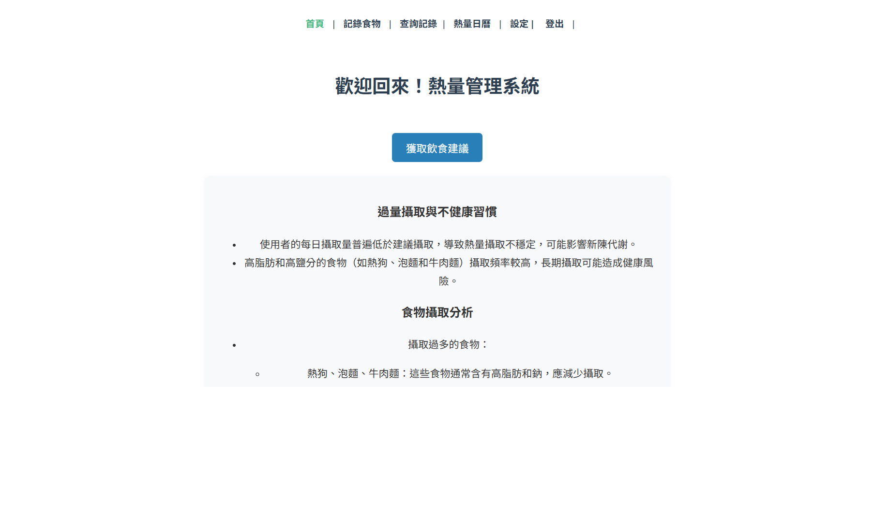
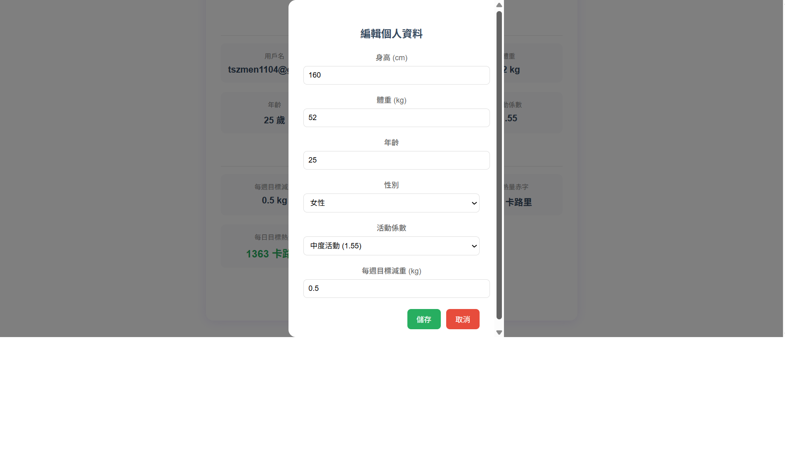
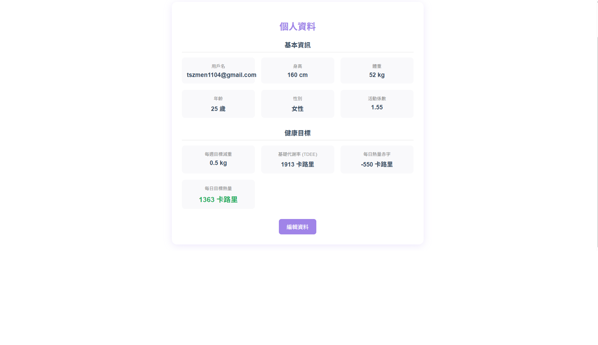
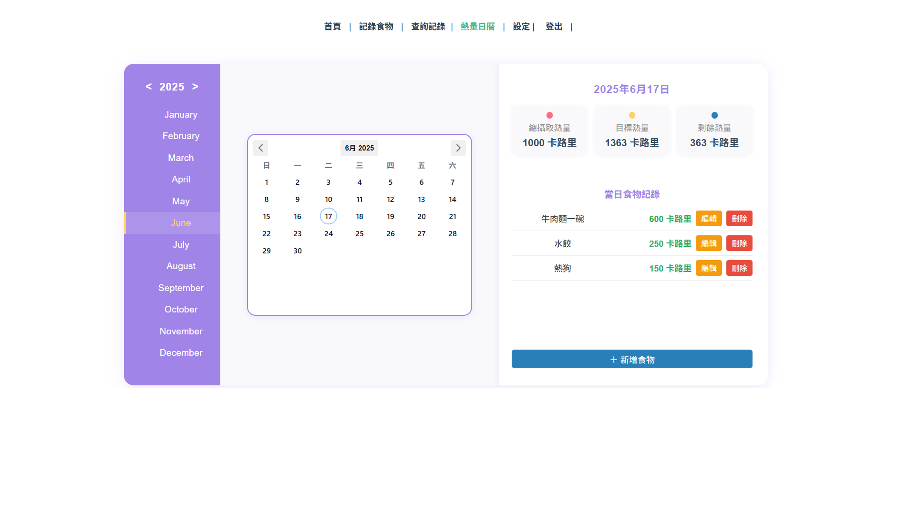
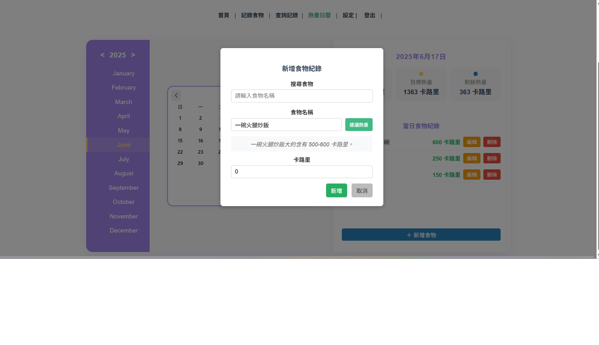
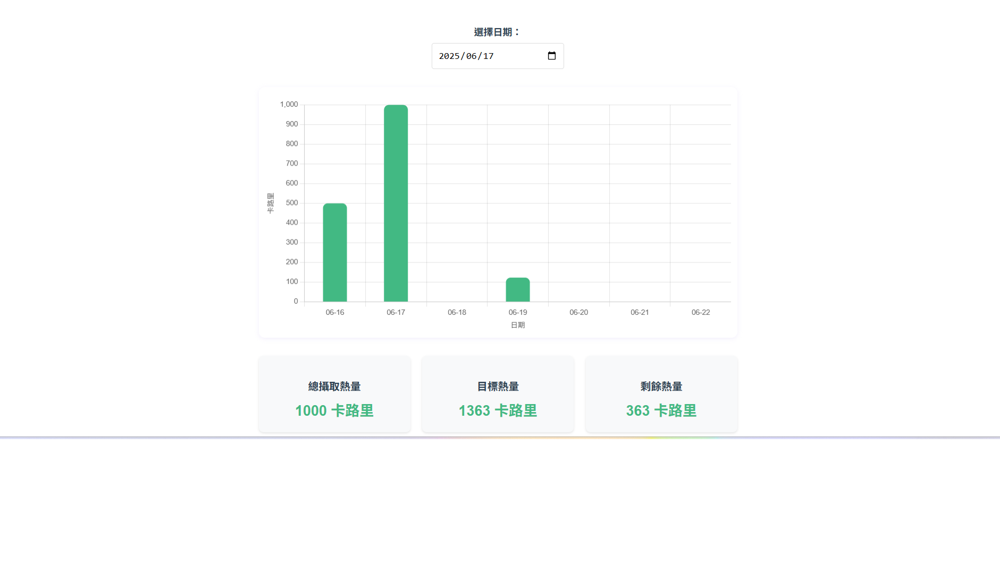
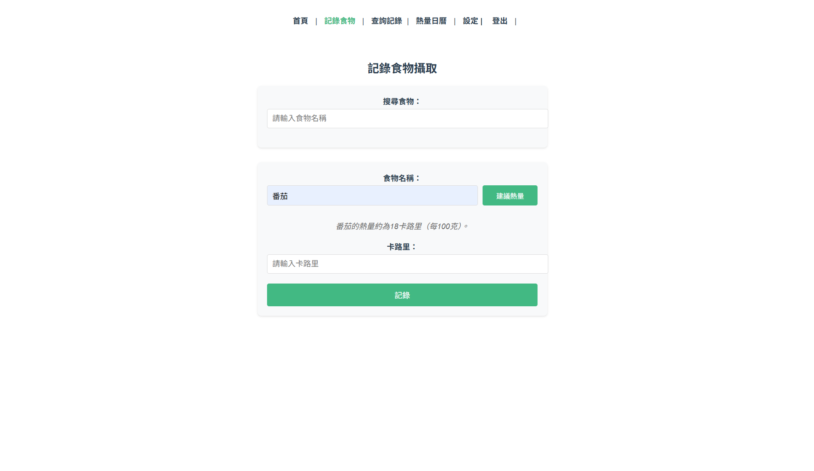

# Calorie Tracker

簡單的熱量追蹤系統，幫助記錄每日飲食並管理攝取的熱量。

---

## 功能特色

-每日飲食紀錄：使用者可手動輸入食物名稱及熱量，或透過整合 ChatGPT 查詢食物熱量，提升輸入便利性與準確度。

-熱量自動計算：系統會統計當天攝取的熱量，並與使用者設定的目標熱量比較，顯示剩餘可攝取的熱量。

-ChatGPT 飲食建議：根據使用者的身高、體重、飲食紀錄等資料，系統會呼叫 ChatGPT 生成健康飲食建議，提醒是否過量攝取或營養均衡，提供個人化飲食指導。

-資料庫管理：建立食物主表與每日飲食細項的關聯，方便資料管理與擴充。

---

#首頁
-ChatGPT 飲食建議：透過點擊獲取飲食建議根據近 7 天紀錄產出、身高體重目標體重等，產出建議（過量攝取與不健康習慣/食物攝取分析），
這部分比較慢，大概10~20秒

#設定

-依照使用者個人資料計算每日總消耗熱量（TDEE, Total Daily Energy Expenditure），作為每日攝取熱量的目標依據。使用者可手動設定熱量目標，或透過以下資訊自動估算：性別、年齡
、身高（cm）、體重（kg）、活動強度（久坐 / 普通 / 運動習慣）

#熱量日曆

-每日食物紀錄的新增、編輯、刪除功能。

-每日熱量總覽。

-ChatGPT 生成建議熱量攝取的功能。

#周熱量

-提供使用者一個以「週」為單位的熱量攝取檢視工具，方便追蹤與分析一週內的飲食狀況，協助飲食管理與健康維護。

#食物資料庫

-食物資料庫讓使用者可儲存所有的食物主檔資訊，包含每種食物的熱量與基本營養成分，方便後續查詢。

